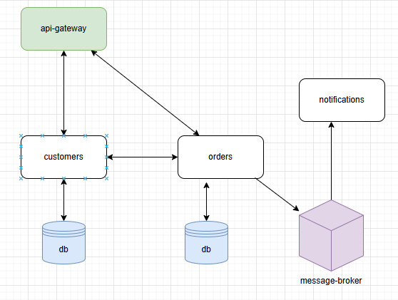

## GLS ASSESSMENT – SaaS Backend System (POC)

### 1. Project Overview

**GLS** is a **SaaS backend system** for logistics and transport companies.  
It manages **customers** and their **orders**, while ensuring that **notifications** are automatically triggered when
order statuses are updated.

The app is based on a **microservices architecture**, with services communicating via **REST APIs** (synchronous) and
**RabbitMQ** (asynchronous).  
A shared external module (`shared-models`) ensures consistency of DTOs and entities across services.

Each service with its own DB can act as an isolated unit that can be scaled independently, supporting horizontal
scalability. The **H2** in memory db is used as poc.

In a real-world scenario, many more elements should be added to grant security, scalability and independence for the services.
Some examples include:
- Using a Oauth2 authentication and authorization provider like **Keycloak**, to secure users and the communication between the services
- Applying a service discovery pattern, using a Spring tool like **Netflix Eureka**
- Using monitoring tools like **Kibana** and **Grafana** for log tracing and performance tracking
- Applying techniques for high availability and performance like **Load Balancers** and **Caching**

### 2. Tech Stack Overview

the services are built using **Kotlin**, **Gradle**, **Spring Boot** and **Java JDK 17**.

#### API Gateway

- **Spring Boot** (Web, WebClient(Spring WebFlux)) for API exposure
- **OpenAPI/Swagger** (Springdoc) for API documentation

---

#### Customers Service

- **PostgreSQL** as primary database (future)
- **H2** for development/testing
- Provides **CRUD operations** for customers

---

#### Orders Service

- **PostgreSQL** as primary database (future)
- **H2** for development/testing
- **RabbitMQ** for event publishing
- Handles **order creation and updates**

---

#### Notifications Service

- **RabbitMQ** for event consumption
- Processes **order update events** and notifies customer contacts

---

#### Shared-Models Module

- Centralized **DTOs, entities, and enums**
- Shared across all services as a **Gradle dependency**

### 3. Running the project (requirements)

#### RabbitMq config

The docker file is here [docker-compose.yml](docs/docker/rabbitmq/docker-compose.yml).
It is required the existence of a topic exchange named `notifications.order`, a queue `notifications.order.queue` and
binding route key `order.updated`.

#### Testing the APIs

A postman collection is provide here [gls.postman_collection.json](docs/gls.postman_collection.json).

#### API DOC

Available at http://localhost:8080/swagger-ui/index.html